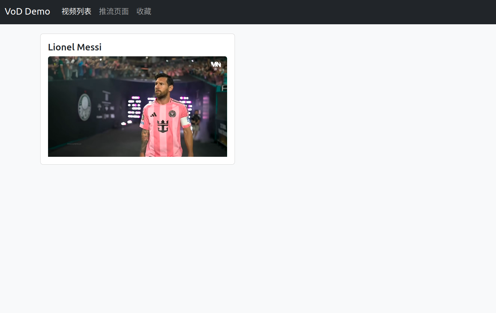

# VoD Demo Report: Building a Video-on-Demand Website Based on CephFS

**Team Members:** Miao Xiangyu, Hu Yifan, Qiu Jiyang, Huang Yu, Xie Wenyuan, Cui Tianyu

---



## 1. Introduction

This project demonstrates the construction of a Video-on-Demand (VoD) website using an open-source object-based file system—CephFS. The system integrates MicroCeph for lightweight cluster deployment, FFmpeg for HLS video slicing, Nginx for media serving, and Flask for frontend presentation. The final result is a functional VoD site similar to the reference figure, capable of streaming segmented video content from CephFS to browsers and media players.

---

## 2. System Architecture Overview

The system consists of the following components:

- **MicroCeph**: Used to deploy a minimal Ceph cluster with loop-backed OSDs.
- **CephFS**: Provides distributed object-based storage for video files and HLS segments.
- **FFmpeg**: Transcodes MP4 videos into HLS format (.m3u8 + .ts).
- **Nginx**: Serves HLS content over HTTP with proper MIME types and CORS headers.
- **Flask**: Hosts the frontend interface for video playback and user interaction.

---

## 3. Ceph Cluster Setup

To ensure redundancy and fault tolerance, three loop-backed OSDs (2GB each) were created and added to MicroCeph. Pools for CephFS metadata and data were initialized with replication size set to 3. The filesystem was mounted locally using the `client.admin` key.

Key commands:
```bash
sudo microceph init
sudo dd if=/dev/zero of=/var/local/osd-1.img ...
sudo microceph disk add /dev/loopX
sudo microceph.ceph fs new mycephfs cephfs_meta cephfs_data
```

---

## 4. HLS Video Preparation

A sample MP4 video was copied to `/mnt/cephfs/videos/` and transcoded into HLS format using FFmpeg. The output `.m3u8` playlist and `.ts` segments were stored in `/mnt/cephfs/hls/`.
```bash
ffmpeg -i sample.mp4 -c:v libx264 -c:a aac -f hls /mnt/cephfs/hls/sample.m3u8
```

---

## 5. Nginx Configuration

Nginx was configured to serve HLS content from `/mnt/cephfs/hls/` using an alias directive. MIME types for `.m3u8` and `.ts` were explicitly defined, and CORS headers were added to support browser playback.
```nginx
location /vod/ {
   alias /mnt/cephfs/hls/;
   types {
      application/vnd.apple.mpegurl m3u8;
      video/mp2t ts;
   }
   add_header Access-Control-Allow-Origin *;
}
```

---

## 6. Flask Frontend Implementation

A simple Flask application was created to host the VoD interface. The frontend uses `hls.js` to load and play HLS streams in modern browsers. Bootstrap was used to style the interface with responsive video cards and navigation.

---

## 7. Conclusion

This project demonstrates the feasibility of building a VoD website using CephFS as the backend storage. The integration of MicroCeph, FFmpeg, Nginx, and Flask provides a modular and scalable solution for media streaming. The architecture is reproducible and extensible for future enhancements such as multi-bitrate streaming, user authentication, and video management.